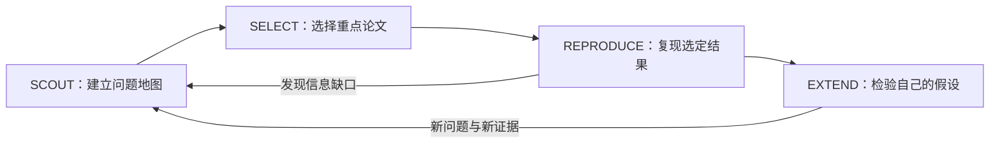

# AI-first SciML Research Workflow

**从进入新领域，到选论文、复现结果，再到开展自己的研究。**

这是一个面向研究生与初学者的轻量工作流。它保存可复用的方法、模板和资料工具，让 AI 帮助连续推进科研任务，让研究者把精力放在问题、理解和证据上。

**v0.1.1 · 2026-10-05**：本版提供工作流文档、模板和两个本地 PDF 工具。复现部分目前是指南与记录框架，实际复现技巧、领域工具和案例将随实践逐步加入；尚无已完成的论文复现实例或通用自动执行器。

## 适合什么领域？

**重点面向 AI for Science，重点服务科学机器学习（Scientific Machine Learning，SciML）中的物理场建模与重构。** 当前实践主要来自计算流体力学、湍流、时空超分辨与 PDE 问题，包括流场重构、科学数据超分辨、代理模型、算子学习、物理约束学习与反问题。相关内容（科学机器学习及物理信息机器学习文献中的研究问题），可以参考：[神经网络求解 PDE 综述](https://doi.org/10.1002/gamm.202100006)、[Physics-informed machine learning](https://doi.org/10.1038/s42254-021-00314-5)。

工作流可以迁移到其他计算研究，但具体代码可能需要修改。例如流体网格、时间推进、守恒量和能谱有自己的定义，需要在相应任务中验证。

## 从哪里开始？

第一次使用可先阅读下方四阶段总览，再复制与当前阶段对应的模板。调研直接从[SCOUT 指南](docs/scout.md)开始；准备复现时使用[选择模板](templates/paper-selection.md)和[复现指南](docs/reproduction.md)。文档本身不需要安装依赖，PDF 工具的运行条件与命令见[工具说明](docs/tools.md)。

## AI-first：从任务出发，通过 AI 组织工具

可以先向 AI 说明科研任务，由它协助检索文献、读取文件、检查代码、组织计算与报告。专业求解器、Python、Git、数据库和绘图工具仍负责各自的工作；AI 提供统一的交互入口与协调能力，减少在多个软件之间手工搬运材料。

| AI 可以承担的工作                | 研究者应建立的理解与判断          |
| ------------------------- | --------------------- |
| 检索、泛读、解释术语、整理 problem map | 什么问题值得研究，任务与实际需求有什么关系 |
| 定位论文证据、分析代码、准备运行方案        | 关键假设、输入条件和评价标准是否合适    |
| 执行已确定范围内的计算、排错、生成图表       | 结果支持什么结论，还有哪些其他解释     |
| 提出候选假设、设计对照和消融            | 选择哪些问题继续投入，与导师共同确定方向  |

**阅读可以更有选择性。** 普通背景文献先看 AI 整理；重点论文则至少能用自己的话解释任务、关键机制、核心实验和适用范围，并能定位到原文或代码。暂时不懂的部分，让 AI 围绕当前问题讲解、举例或做小验证。这样，学习与获得结果可以同步推进。

这里把 AI-first 作为工作流设计原则；所参考的自动化项目展示了具体能力，并不足以证明“所有科研软件都会被替代”已成为普遍共识。

## 四个阶段



| 阶段                  | 核心问题               | 主要工作                           | 最小交付                 |
| ------------------- | ------------------ | ------------------------------ | -------------------- |
| **SCOUT** 调研与初步学习   | 这个领域在解决什么？         | 主线综述、AI 泛读、输入—目标—方法分类，补必要概念    | 问题地图、文献索引、待讨论问题      |
| **SELECT** 选择跟进对象   | 哪篇最值得深入，能先验证什么？    | 比较任务相关性、代表性、代码／数据可用性、成本和可验证程度  | 少量重点论文，以及每篇入选理由和首个目标 |
| **REPRODUCE** 复现与理解 | 指定条件下，能否得到论文报告的结果？ | 核对论文、代码与数据，准备环境，最小运行，核心实验，结果核验 | 命令、版本、原始输出、指标对照、差异解释 |
| **EXTEND** 扩展研究     | 哪个有意义的假设值得检验？      | 文献补查、假设、基线、受控修改、消融及适用范围分析      | 能支持或否定具体假设的一组证据      |

核验贯穿四阶段：引文与任务分类需要核对，运行结果需要核对，新的研究结论也需要核对。发现数据或定义不合适时，可以回到前一阶段调整。

### 1. SCOUT：沿用已经形成的调研方法

先明确本轮要支持什么讨论，用综述和代表作建立领域地图，再分层阅读。重点是研究对象、输入来源、输出用途、方法设计理由及证据范围。

入口：[调研指南](docs/scout.md)、[领域地图模板](templates/field-map.md)、[单篇阅读模板](templates/paper-note.md)、[综合汇报模板](templates/review-report.md)。

### 2. SELECT：选论文，也选第一个可完成的目标

优先选择问题相关、实验清楚、资源可获得、能在当前预算内检验关键结果的论文。代码易跑是优势，论文是否值得研究仍要结合问题价值判断。

先问“第一步能复现哪张图、哪项指标或哪个关键行为”，再估算完整工作的成本。首轮可以只选一篇主论文与少量基线／背景参照。选择本身要留下理由，避免因为模型新、排名高或名字熟悉就投入大量时间。

入口：[重点论文选择模板](templates/paper-selection.md)。

### 3. REPRODUCE：代码来源决定起点，结果核验决定完成程度

| 实际情况                  | 起步方式                                        |
| --------------------- | ------------------------------------------- |
| 官方代码与必要资源齐备           | 优先复跑官方实现，固定版本并核对配置、数据划分和评价流程                |
| 官方代码只覆盖部分方法，或版本／资源有缺口 | 明确缺失部分，再修复、补实现或缩小复现范围；把新增部分单独记录             |
| 没有可用官方代码              | 依据论文、附录与可核实资料重实现；可借鉴 PaperCoder 的规划、分析、生成流程 |
| 原数据、权重或预算暂不可用         | 明确能做的实现验证／缩小实验及其限制，或换一个更适合的首个目标             |

共同流程：**目标结果 → 代码与数据对应 → 环境准备 → smoke test → 选定核心实验 → 指标／图表核验**。Smoke test 是少量数据和短步数下的连通性检查；论文的主结果需要在对应设置下另行检验。完整复现整篇论文可作为后续目标。

基线比较在复现阶段就要理解。使用已训练权重得到一个结果、重新训练得到相近结果、独立重实现得到相近结果，所完成的工作不同，应分别说明。

入口：[复现与扩展指南](docs/reproduction.md)、[复现计划与结果模板](templates/reproduction-plan.md)。新建或迁移项目时，先看[目录、接口与项目地图指南](docs/project-bootstrap.md)，填写[项目启动模板](templates/project-layout.md)。

### 4. EXTEND：从已有证据中提出可检验的改变

先说明“为什么可能有效”以及“什么结果会使这个判断不成立”，再选择修改模型、表示方式、数据条件、损失或求解流程。数学解释、误差分析、恢复极限和评价方法也可以构成研究贡献，不必把扩展固定成换网络。

保留可用的基线，在可比设置下检验关键改变。新模型与基线使用不同数据时，要先判断是在比较方法，还是同时改变了任务。消融用于检查各组成部分的作用；稳健性与泛化实验用于说明结论的适用范围。

入口：[扩展实验模板](templates/experiment-note.md)。

## 初次使用

初次实践适合选择一个短周期，这样在科研初期能够快速获得正反馈：**一篇重点论文 → 一项可信复现结果 → 一个自己讲得清的机制或失败原因 → 一项小范围假设检验**。

每一步都留下可以展示和重做的成果。未复现也能带来信息，但先排查实现、数据和设置差异，再讨论科学原因。

## 外部项目怎样使用？

我们参考了 [Reproduce Research Paper](https://github.com/FullFighting/reproduce-research-paper)、[Paper2Code／PaperCoder](https://github.com/going-doer/Paper2Code)、[OpenAI PaperBench](https://github.com/openai/frontier-evals/tree/main/project/paperbench)，另补了 [CORE-Bench](https://github.com/siegelz/core-bench)。它们分别提供复现流程、代码生成方法或评测参照，具体定位与限制见[项目核对记录](docs/references.md)。

当前以文档与模板连接这些工作，不要求安装所有项目。后续选定论文后，使用与任务匹配的工具；重复稳定的步骤再封装成 Skill。

## 版本计划：先发布工作流，再积累实用技巧

复现框架先保留，工具和案例由真实任务带动。后续优先从以下问题中整理可复用经验：

- 科学数据的网格、坐标、变量位置、单位与无量纲化怎样核对。
- 粗细数据如何产生，如何划分训练／测试、处理归一化与时间序列，避免信息泄漏。
- 方程、初边值条件、时间步长和离散算子怎样对应论文与代码。
- 如何一致地计算误差、能谱、物理统计及在线求解器结果。
- 哪些环境配置、最小运行、检查点和评价代码值得抽成工具。

这些是待积累的主题，**不是本版已经实现的功能**。新增技巧先记录适用场景、原始问题、解决办法与验证结果；确实重复有用时再抽取代码，放入可重做的小例子。暂时不用为每类问题预先搭建框架。

版本变化见 [CHANGELOG](CHANGELOG.md)。具体论文的模型、训练与大规模计算继续放在各自研究仓库中，本仓库收录能迁移的经验和入口。

## 仓库组织

```text
ai-first-sciml-workflow/
  README.md
  docs/                  # 调研、复现、工具与外部参考
  templates/             # 各阶段可直接填写的模板
  cases/                 # 具体案例的记录约定；当前尚无复现实例
  tools/                 # 已有 PDF 核验与提图工具
  requirements.txt       # 仅现有 PDF 工具的依赖
  CHANGELOG.md
  LICENSE
  .gitignore
```

通用流程放在本仓库；各论文的代码、环境和大数据在独立实验目录中管理。`cases/` 用简洁记录连接论文、实现、配置、运行结果和结论，避免不同论文的依赖混在一起。记录环境不等于必须新建环境，具体使用已有环境、容器或新环境时按项目条件确定。

开始使用：[案例记录约定](cases/README.md)。资料处理：[下载、核验、文字转换与裁图](docs/tools.md)。

本仓库自有文档、模板和脚本采用 [MIT License](LICENSE)；第三方项目、依赖与论文材料保留各自许可，见[来源与依赖说明](THIRD_PARTY.md)。本仓库不打包论文全文、论文截图、训练数据或模型权重。
